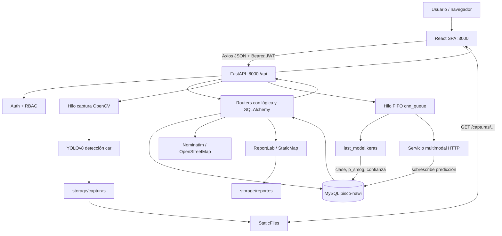
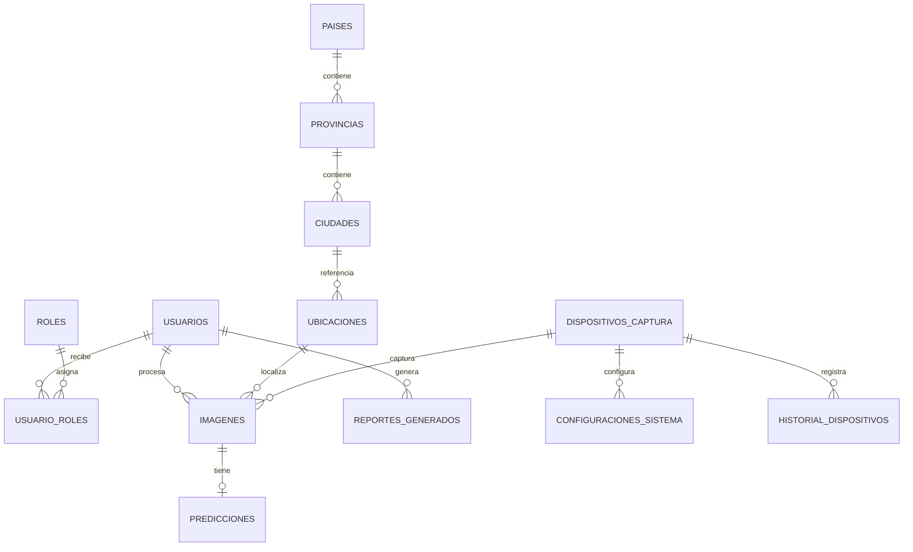
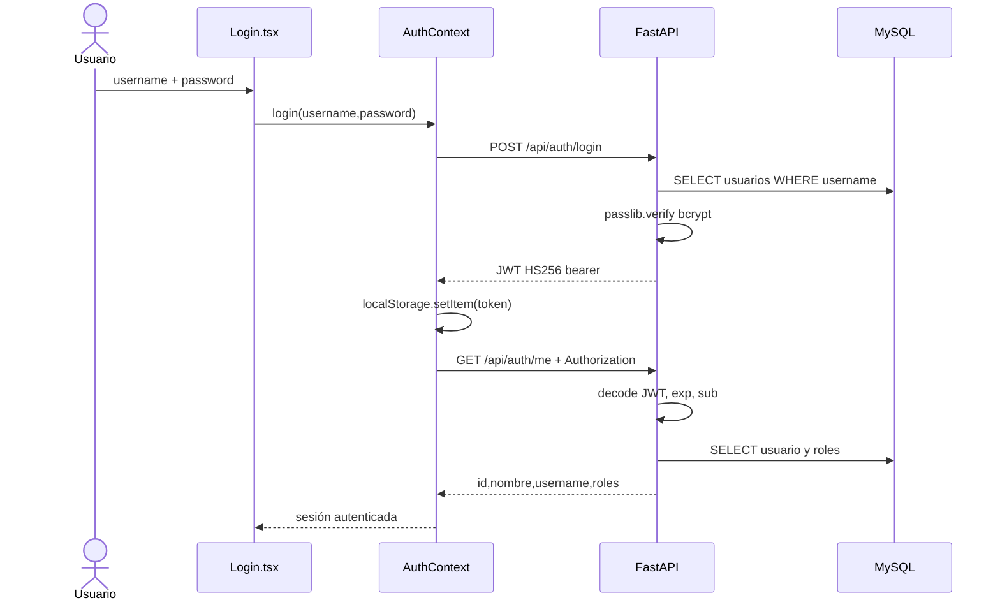

# Auditoría técnica del sistema web PISCONAWI IA para defensa

> **Fecha de inspección:** 5 de octubre de 2026  
> **Alcance:** código y configuración presentes en este repositorio. No se inspeccionó la base MySQL real, hardware de cámara, archivos ignorados por Git ni el proyecto donde se entrenó la CNN.  
> **Regla de lectura:** **[CONFIRMADO POR CÓDIGO]** describe comportamiento visible en fuentes; **[CONFIRMADO POR CONFIGURACIÓN]** procede de manifiestos o ejemplos; **[INFERIDO]** es una conclusión razonable que debe comprobarse en ejecución; **[NO ENCONTRADO]** indica ausencia en la copia inspeccionada; **[REQUIERE CONFIRMACIÓN DEL AUTOR]** señala datos externos o históricos.

## 1. Resumen ejecutivo

**[CONFIRMADO POR CÓDIGO]** Es una aplicación web monorrepositorio para capturar imágenes de automóviles con una cámara, detectar automóviles con YOLO, clasificar smog mediante una CNN Keras, enriquecer o sustituir esa clasificación mediante un servicio multimodal HTTP, persistir imágenes/predicciones/localización en MySQL y consultar o exportar resultados.

La implementación real tiene tres capas principales:

1. SPA React/TypeScript, con Axios, React Router, Tailwind, Leaflet y Recharts.
2. API FastAPI/Python, organizada por routers, con Pydantic, SQLAlchemy y servicios de captura/inferencia/reportes.
3. MySQL, con 13 modelos ORM y relaciones explícitas.

No es una arquitectura estricta controller/service/repository: los endpoints contienen consultas y reglas, `db.py` concentra todos los modelos, y sólo la inferencia/cola y generación PDF están separadas como servicios/módulos. Hay dos etapas de IA distintas: YOLO para decidir cuándo capturar un automóvil, y una CNN binaria local para smog; después, un servicio multimodal externo vuelve a analizar las imágenes y sobrescribe la predicción local.

**Hallazgo crítico de reproducibilidad:** **[NO ENCONTRADO]** no están en el repositorio `backend/models/last_model.keras` ni `backend/modules/yolov8n.pt`, aunque el código los exige. Ambos patrones de pesos están ignorados por `.gitignore`. Sin esos artefactos la importación completa del backend/captura o la inferencia CNN no puede funcionar.

**Hallazgo crítico de código:** varios endpoints declarados desde la línea 308 de `backend/modules/analisis/analisis.py` están indentados dentro de `analizar_todas_imagenes_hoy` y después de un `return`. Por ello sus decoradores nunca se ejecutan y las rutas `/imagenes`, `/predicciones`, `/ubicaciones`, `/por-dispositivo` y varias de edición/borrado no quedan registradas. Además, parte de sus cuerpos tiene indentación incoherente. Ninguna pantalla actual parece consumirlos.

## 2. Tecnologías e inventario

### 2.1 Lenguajes, frameworks y dependencias

| Área | Hallazgo | Estado |
|---|---|---|
| Backend | Python; FastAPI 0.104.1; Uvicorn 0.24.0; Pydantic incluido por FastAPI | [CONFIRMADO POR CONFIGURACIÓN] |
| Persistencia | MySQL vía PyMySQL 1.1.0 y SQLAlchemy 2.0.23 | [CONFIRMADO POR CÓDIGO] |
| Seguridad | `python-jose`, JWT HS256, Passlib + bcrypt | [CONFIRMADO POR CÓDIGO] |
| IA local | TensorFlow 2.15, Pillow, NumPy; Ultralytics importado desde wheel local/no listado en requirements | [CONFIRMADO POR CÓDIGO] |
| Visión/captura | OpenCV; YOLO de Ultralytics; cámara índice `0` | [CONFIRMADO POR CÓDIGO] |
| IA externa | HTTPX contra endpoint estilo chat-completions multimodal | [CONFIRMADO POR CÓDIGO] |
| Reportes | ReportLab, StaticMap; consultas agregadas SQLAlchemy | [CONFIRMADO POR CÓDIGO] |
| Frontend | React 18, TypeScript 4.9, React Router 6, Axios | [CONFIRMADO POR CONFIGURACIÓN] |
| UI | Tailwind, Heroicons, Framer Motion, Leaflet/React Leaflet, Recharts | [CONFIRMADO POR CONFIGURACIÓN] |
| Pruebas | pytest, pytest-asyncio; 24 pruebas backend encontradas; configuración CRA/Jest sin tests frontend encontrados | [CONFIRMADO POR CÓDIGO] |
| Empaquetado | npm/package-lock en frontend; `requirements.txt`; wheel Ultralytics 8.4.7 en backend | [CONFIRMADO POR CONFIGURACIÓN] |

### 2.2 Configuración y variables de entorno

| Variable | Consumidor | Default/ejemplo | Observación |
|---|---|---|---|
| `DATABASE_URL` | `backend/db.py` | default con MySQL `root:Smog2026!@127.0.0.1:3306/pisco-nawi`; ejemplo usa `root:root@localhost:3307` | Defaults contradictorios y credencial embebida. |
| `SECRET_KEY` | `modules/auth/auth.py` | `your-secret-key-here` | El default de `backend/config.py` es otro y ese módulo no es el usado por auth. |
| `MODELO_API_KEY` | `services/config.py` | placeholder | Se envía como Bearer al proveedor externo. |
| `MODELO_BASE_URL` | `services/config.py` | URL placeholder | Servicio multimodal externo. |
| `MODELO_DECISOR_ID` | `services/config.py` | `gpt-4o-mini` según ejemplo | Modelo remoto real requiere confirmación. |
| `MODELO_NOMBRE` | sólo ejemplo | `ModeloCNNbinario` | [INFERIDO] parece no consumida. |
| `REACT_APP_API_BASE_URL` | `frontend/src/lib/api.ts` | `http://localhost:8000/api` | Se fija al compilar CRA. |

No se halló un `.env` versionado, Docker/Compose, migraciones Alembic, CI, esquema SQL ni datos semilla.

## 3. Árbol simplificado del proyecto

```text
PiscoNawi/
├── backend/
│   ├── main.py                     # entrada FastAPI, CORS, routers, estáticos
│   ├── db.py                       # motor, sesión y 13 modelos SQLAlchemy
│   ├── config.py / env.example     # configuración (hay duplicidad)
│   ├── modules/
│   │   ├── auth/auth.py            # login, bcrypt, JWT
│   │   ├── captura/captura.py      # cámara + YOLO + archivos
│   │   ├── analisis/analisis.py    # procesamiento, consulta, análisis remoto
│   │   ├── usuarios/usuarios.py    # CRUD usuarios/perfil
│   │   ├── roles/roles.py          # RBAC y asignaciones
│   │   ├── catalogos/catalogos.py  # países/provincias/ciudades
│   │   ├── dispositivos/...        # dispositivos e historial
│   │   ├── configuraciones/...     # pares clave/valor
│   │   └── reportes/               # métricas, PDF e historial operador
│   ├── services/
│   │   ├── smog_model.py           # carga/preproceso/inferencia Keras
│   │   ├── cnn_queue.py            # cola FIFO/hilo/persistencia/postproceso
│   │   ├── modelo_service.py       # llamada multimodal externa
│   │   └── config.py               # variables del proveedor
│   ├── tests/                       # pruebas API/unitarias
│   ├── requirements.txt
│   └── ultralytics-8.4.7-...whl
├── frontend/
│   ├── src/
│   │   ├── index.tsx / App.tsx     # arranque y rutas
│   │   ├── contexts/AuthContext.tsx
│   │   ├── lib/api.ts / rbac.ts
│   │   ├── components/             # navbar, guards, intro, footer
│   │   └── pages/                   # 8 operativas + 7 administrativas
│   ├── public/                      # imágenes y videos
│   ├── build/                       # build versionado aunque ignorado
│   └── package.json
├── storage/capturas/                # esperado en runtime; ignorado/no presente
├── car_detector.py                  # script YOLO alternativo/legado
├── README.md
├── SETUP_GUIDE.md
└── IMPLEMENTATION_NOTES.md
```

## 4. Arquitectura real



**Secuencia central real:** la cámara no escribe directamente a la BD. Guarda JPEG en disco. Al pulsar “Procesar Capturas”, el navegador obtiene geolocalización, FastAPI crea primero una `ubicacion`, lanza un hilo, el hilo recorre archivos sin predicción, crea/actualiza `imagenes`, ejecuta Keras, inserta `predicciones` y finalmente llama al proveedor externo para las imágenes del día, sobrescribiendo los tres valores de clasificación.

No existen capas repository. Los “controllers” son las funciones de ruta. La cola usa estado global en memoria y una sesión SQLAlchemy propia.

## 5. Funcionalidades reales

| Prioridad | Funcionalidad | Quién | Pantalla/componente | Endpoint y función | Tablas/archivos |
|---|---|---|---|---|---|
| Central | Login y restauración de sesión | Usuario válido | `Login.tsx`, `AuthContext` | `POST /auth/login` → `login`; `GET /auth/me` | `usuarios`, `roles`, `usuario_roles`; `auth.py`, `main.py` |
| Central | Captura automática de automóvil | Cualquiera de 4 roles internos | `Captura.tsx` | iniciar/detener/estado → funciones homónimas | Archivos `storage/capturas`; `captura.py`; no BD |
| Central | Listar/eliminar capturas | 4 roles internos | `Captura.tsx` | `GET /captura/imagenes`, `DELETE /captura/eliminar/{filename}` | Sistema de archivos |
| Central | Procesar capturas con CNN | 4 roles internos | `ProcesarCapturas.tsx` | `POST /analisis/procesar-cnn` → `procesar_cnn` | `ubicaciones`, `ciudades`, `dispositivos_captura`, `imagenes`, `predicciones`; cola/CNN |
| Central | Ver avance de cola | 4 roles internos | `ProcesarCapturas.tsx` | `GET /analisis/estado-cnn` | Estado global en RAM |
| Central | Ver resultados | 4 roles internos | `Analisis.tsx` | `GET /analisis/emisiones` | `imagenes` JOIN `predicciones` |
| Central | Reanalizar todo lo de hoy | 4 roles internos | `AnalisisMasivo.tsx` | `POST /analisis/analizar-todas-hoy` | `imagenes`, `predicciones`; proveedor externo |
| Alta | Dashboard de métricas | analista/admin/dev | `Reportes.tsx` | 9 endpoints `/reports/*` | imágenes, predicciones, ubicaciones, usuarios |
| Alta | Generar/listar/descargar PDF | analista/admin/dev | `ReportesGenerados.tsx` | `/reportes-generados/*` | `reportes_generados`, archivos, consultas de informes |
| Media | Historial propio | operador/admin/dev | `HistorialOperador.tsx` | `GET /operator/historial-propio` | `imagenes`, `predicciones` filtradas por usuario |
| Media | Usuarios y perfil | según endpoint | `UsuariosAdmin.tsx`, `Perfil.tsx` | `/usuarios/*` | `usuarios` |
| Media | Roles y asignaciones | admin/dev (algunas escrituras sólo admin) | `RolesAdmin.tsx` | `/roles/*` | `roles`, `usuario_roles`, `usuarios` |
| Media | Catálogos geográficos | 4 roles internos | `Catalogos.tsx` | `/catalogos/*` | `paises`, `provincias`, `ciudades` |
| Media | Dispositivos/historial | 4 roles internos | `DispositivosAdmin.tsx` | `/dispositivos/*` | `dispositivos_captura`, `historial_dispositivos` |
| Baja | Configuración clave/valor | admin/dev | `ConfiguracionesSistema.tsx` | `/configuraciones/*` | `configuraciones_sistema` |

## 6. Base de datos — diccionario de datos

### 6.1 Motor, conexión y reglas generales

- **[CONFIRMADO POR CÓDIGO]** MySQL, dialecto `mysql+pymysql`, SQLAlchemy declarativo y sesiones sin autocommit/autoflush.
- El engine usa `pool_pre_ping=True` y recicla conexiones cada 3600 s.
- `main.py` prueba conexión y ejecuta `Base.metadata.create_all()` durante importación/arranque. Esto crea tablas ausentes, pero no sustituye migraciones para cambios de columnas.
- **[NO ENCONTRADO]** Alembic, migraciones, `ondelete`, cascadas ORM explícitas, `CheckConstraint`, defaults de servidor, índices compuestos o control transaccional formal.
- Todos los PK tienen índice implícito/`index=True`; `usuarios.username` es `UNIQUE`; `predicciones.imagen_id` es `UNIQUE`, materializando 1:1. La tabla puente no declara unicidad `(usuario_id, rol_id)`, aunque la API evita duplicados antes de insertar.
- Nullability y tipos siguientes describen el ORM, no garantizan que la BD desplegada sea idéntica. **[REQUIERE CONFIRMACIÓN DEL AUTOR]** comparar `SHOW CREATE TABLE`.

### 6.2 Diccionario por tabla

#### `paises`
- **Propósito:** catálogo raíz geográfico.
- **Columnas:** `id INT` PK obligatorio; `nombre VARCHAR(100)` obligatorio; `codigo_iso VARCHAR(10)` opcional; `created_at`, `updated_at TIMESTAMP` opcionales.
- **Relaciones:** 1:N con `provincias`.
- **Código/funcionalidad:** `db.Pais`, CRUD parcial en `catalogos.py`, pantalla Catálogos. No hay delete.

#### `provincias`
- **Propósito:** subdivisiones de un país.
- **Columnas:** `id` PK; `nombre VARCHAR(100)` requerido; `pais_id INT` requerido FK; timestamps opcionales.
- **FK/relaciones:** `pais_id → paises.id`; N:1 país, 1:N ciudades.
- **Código/funcionalidad:** `db.Provincia`, endpoints de catálogo y selectores encadenados.

#### `ciudades`
- **Propósito:** catálogo urbano y referencia geográfica más cercana.
- **Columnas:** `id` PK; `nombre` requerido; `provincia_id` FK requerido; `latitud DECIMAL(10,8)`, `longitud DECIMAL(11,8)` y timestamps opcionales.
- **Relaciones:** N:1 provincia; 1:N ubicaciones.
- **Código/funcionalidad:** catálogo y `_resolver_ciudad_id`, que ordena por distancia cuadrática aproximada en grados.

#### `usuarios`
- **Propósito:** identidades autenticables.
- **Columnas:** `id` PK; `nombre VARCHAR(255)` requerido; `username VARCHAR(255)` requerido y único; `password_hash VARCHAR(255)` requerido; `creado_en DATETIME` opcional.
- **Relaciones:** 1:N imágenes; 1:N reportes; 1:N asignaciones de rol.
- **Código/funcionalidad:** auth, usuarios/perfil, RBAC, atribución de análisis/reportes. “Desactivar” no tiene estado: cambia `password_hash` por un hash de `DISABLED-{id}-{timestamp}`.

#### `roles`
- **Propósito:** catálogo de roles RBAC.
- **Columnas:** `id` PK; `nombre VARCHAR(100)` requerido; `descripcion VARCHAR(255)` opcional.
- **Relaciones:** 1:N `usuario_roles`.
- **Código/funcionalidad:** `roles.py`, `AuthContext`, guards y navbar. El ORM no marca `nombre` único.

#### `usuario_roles`
- **Propósito:** tabla intermedia N:M entre usuarios y roles.
- **Columnas:** `id` PK; `usuario_id` y `rol_id` requeridos.
- **FK:** a `usuarios.id` y `roles.id`.
- **Código/funcionalidad:** carga de permisos y administración de asignaciones. Sin constraint compuesto en ORM.

#### `ubicaciones`
- **Propósito:** localización de un lote/proceso de captura.
- **Columnas:** `id BIGINT UNSIGNED` autoincremental PK; latitud/longitud DECIMAL requeridas; `altitud`, `precision_metros`, `departamento`, `direccion`, `codigo_postal`, `fecha_captura`, `dispositivo`, `direccion_ip`, timestamps y `ciudad_id` opcionales.
- **FK/relaciones:** `ciudad_id → ciudades.id`; 1:N imágenes.
- **Código/funcionalidad:** creada por `/procesar-cnn`, usada en reportes por ubicación/zona. Muchos campos nunca se rellenan desde el flujo actual.

#### `dispositivos_captura`
- **Propósito:** inventario de equipos.
- **Columnas:** `id` PK; `nombre_dispositivo` requerido; tipo, marca, modelo, resolución, FPS, interfaz, ubicación física, fecha instalación y `activo BOOLEAN` opcionales.
- **Relaciones:** 1:N imágenes, configuraciones e historial.
- **Código/funcionalidad:** administración; selección del primer dispositivo activo para etiquetar el lote CNN.

#### `configuraciones_sistema`
- **Propósito:** configuración genérica clave/valor, opcionalmente por dispositivo.
- **Columnas:** `id` PK; `clave VARCHAR(100)` requerida; `valor`, `descripcion` opcionales; `dispositivo_captura_id` FK opcional.
- **Relaciones:** N:1 dispositivo.
- **Código/funcionalidad:** pantalla Configuraciones. **[CONFIRMADO POR CÓDIGO]** no se observó que captura/CNN lea estas claves.

#### `historial_dispositivos`
- **Propósito:** intervalos/observaciones del equipo.
- **Columnas:** `id BIGINT` PK (la API calcula `max(id)+1`); `dispositivo_id` requerido; fechas inicio/fin y observaciones opcionales.
- **FK/relaciones:** N:1 dispositivo.
- **Código/funcionalidad:** pestaña historial en Dispositivos.

#### `imagenes`
- **Propósito:** metadato persistente de cada archivo procesado.
- **Columnas:** `id` PK; `filename_original` y `ruta_archivo` requeridos; `placa_manual`, fecha, `usuario_id`, `ubicacion_id`, `dispositivo_captura_id` opcionales.
- **FK:** usuario, ubicación y dispositivo.
- **Relaciones:** N:1 a esas entidades; 1:1 con predicción.
- **Código/funcionalidad:** núcleo de cola, resultados, historial y reportes. `ruta_archivo` se guarda como URL absoluta `http://localhost:8000/capturas/...`.

#### `predicciones`
- **Propósito:** salida vigente de análisis por imagen.
- **Columnas:** `id` PK; `imagen_id` requerido, FK y único; `clase_predicha VARCHAR(255)`, `confianza FLOAT`, `p_smog FLOAT` requeridos; fecha y observación opcionales.
- **Relaciones:** 1:1 inversa con imagen.
- **Estados:** clases producidas `smog`/`sin_smog`; probabilidades pretendidamente 0..1, sin CHECK SQL.
- **Código/funcionalidad:** CNN, postproceso remoto, resultados, KPIs, PDFs. No guarda versión del modelo ni predicción histórica.

#### `reportes_generados`
- **Propósito:** catálogo de PDFs materializados.
- **Columnas:** `id` PK; nombre y ruta requeridos; fecha opcional; `usuario_id` FK requerido.
- **Relaciones:** N:1 usuario.
- **Código/funcionalidad:** exportación, listado, detalle y descarga de PDF; el archivo vive fuera de la BD.

## 7. ERD



### 7.1 Recorridos pantalla → tabla

1. `Login.tsx` → `AuthContext.login` → `POST /api/auth/login` → `main.login` → `authenticate_user` → SELECT `usuarios`; luego `/auth/me` → JOIN `roles`/`usuario_roles`.
2. `ProcesarCapturas.tsx` → `startCnnProcessing` → `POST /api/analisis/procesar-cnn` → crea `ubicaciones` → `cnn_queue.start_queue` → inserta `imagenes` y `predicciones`.
3. `Analisis.tsx` → `GET /api/analisis/emisiones` → `obtener_analisis_emisiones` → JOIN `imagenes`/`predicciones` → tabla visual.
4. `UsuariosAdmin.tsx` → POST `/api/usuarios` → `crear_usuario` → bcrypt → INSERT `usuarios`.
5. `ReportesGenerados.tsx` → POST `/api/reportes-generados/exportar-pdf` → renderizador según tipo → archivo PDF + INSERT `reportes_generados`.

### 7.2 Impacto de cambios de esquema (sin ejecutarlos)

- **Agregar campo:** diseñar null/default y migración SQL; añadir `Column`; actualizar Pydantic de entrada/salida, consultas/constructores, formulario e interfaces TypeScript; incorporar prueba. `create_all()` no añade confiablemente columnas a tablas existentes.
- **Eliminar campo:** localizar lecturas/escrituras con `rg`; retirar UI, schemas, serialización y consultas antes de migrar. Si se elimina primero, el backend fallará con “unknown column”.
- **Cambiar tipo:** evaluar datos actuales y conversión MySQL, precisión (especialmente DECIMAL→float), schemas y controles HTML; migrar con respaldo y probar ida/vuelta.
- **Agregar relación:** crear FK e índice, relationship en ambos modelos si corresponde, decidir nullability/cascadas, exponer IDs de forma validada y definir conducta al borrar.
- **Modificar FK:** auditar huérfanos y cardinalidad, ordenar migración de constraint/datos, cambiar joins y asignaciones. Sin `ondelete`, las eliminaciones pueden ser rechazadas por MySQL.

## 8. Backend

### 8.1 Estructura y comportamiento

- Entry point: `backend/main.py`; construye app, conecta/crea tablas, configura CORS sólo para `http://localhost:3000`, monta `/capturas` y registra 10 routers.
- Controllers: funciones decoradas en `backend/modules/**`.
- Services: `smog_model`, `cnn_queue`, `modelo_service`; generadores PDF.
- Models/repositorios: 13 clases en `db.py`; no hay repositorios.
- Middleware: sólo CORS. Auth/autorización se implementan como dependencias FastAPI.
- Validación: Pydantic y parámetros tipados; varias reglas manuales (existencia, username duplicado, traversal). No hay validadores de rangos para coordenadas/probabilidades/FPS.
- Errores: `HTTPException` en rutas; varios `except Exception`; el worker oculta detalles con `print("modelo no encontrado")`.
- Archivos: capturas estáticas y PDFs; no hay endpoint multipart de subida.

## 9. Inventario de endpoints realmente registrados

Leyenda auth: **Público**, **JWT**, **Interno** (JWT + uno de los cuatro roles), **A/D** (admin o constructor), **A** (admin), **según alcance**.

| Método y ruta | Función/archivo | Auth | Entrada/validación | Proceso/tablas | Respuesta/consumidor |
|---|---|---|---|---|---|
| GET `/` | `root`, `main.py` | Público | — | health textual | mensaje; no SPA |
| POST `/api/auth/login` | `login`, `main.py` | Público | JSON username/password | `usuarios`, bcrypt, JWT | token; AuthContext |
| GET `/api/auth/me` | `get_current_user_info` | JWT | Bearer | usuario + roles | perfil/roles; AuthContext |
| POST `/api/captura/iniciar` | `iniciar_captura` | Interno | — | hilo cámara/YOLO | estado; Captura |
| POST `/api/captura/detener` | `detener_captura` | Interno | — | detiene/join hilo | estado; Captura |
| GET `/api/captura/estado` | `obtener_estado_captura` | Interno | — | RAM | estado; Captura |
| GET `/api/captura/logs` | `obtener_logs_captura` | Interno | — | lista archivos | texto; no consumidor hallado |
| GET `/api/captura/imagenes` | `listar_imagenes_capturadas` | Interno | — | filesystem | lista URL/fecha; Captura/Procesar |
| DELETE `/api/captura/eliminar/{filename}` | `eliminar_imagen` | Interno | bloquea `/`, `\\`, `..` | borra archivo | mensaje; Captura |
| GET `/api/analisis/emisiones` | `obtener_analisis_emisiones` | Interno | — | JOIN imágenes/predicciones | lista; Análisis |
| POST `/api/analisis/analizar/{imagen_id}` | `analizar_con_ia` | Interno | IDs existentes | servicio remoto, UPDATE predicción | resultado; no consumidor hallado |
| POST `/api/analisis/procesar-cnn` | `procesar_cnn` | Interno | JSON `lat`,`lng` float | Nominatim, ubicación, cola | inicio + ID; Procesar |
| GET `/api/analisis/estado-cnn` | `estado_cnn` | Interno | — | RAM | progreso; Procesar |
| POST `/api/analisis/analizar-todas-hoy` | `analizar_todas_imagenes_hoy` | Interno | — | remoto, imágenes/predicciones | contadores; Análisis masivo |
| GET `/api/operator/historial-propio` | `get_historial_propio` | roles operador/admin/dev | filtros de fecha opcionales | imágenes/predicciones del usuario | lista; Historial |
| GET `/api/usuarios` | `listar_usuarios` | analista/admin/dev | — | usuarios | lista; Usuarios/Roles |
| GET `/api/usuarios/id/{id}` | `obtener_usuario` | analista/admin/dev | existe | usuarios | objeto; sin consumidor directo |
| POST `/api/usuarios` | `crear_usuario` | A/D | JSON requerido; username único | bcrypt, INSERT usuario | usuario; Usuarios |
| PUT `/api/usuarios/id/{id}` | `actualizar_usuario` | A/D | parciales, username único | UPDATE; hash opcional | usuario; Usuarios |
| POST `/api/usuarios/id/{id}/desactivar` | `desactivar_usuario` | A | existe | reemplaza hash | mensaje; Usuarios |
| GET `/api/usuarios/me/perfil` | `mi_perfil` | JWT | — | usuario | perfil; Perfil |
| PUT `/api/usuarios/me/perfil` | `actualizar_mi_perfil` | JWT | parciales | usuario/hash | perfil; Perfil |
| GET `/api/roles/me` | `get_current_user_roles` | JWT | — | roles/asignaciones | roles; sin consumidor (me ya los da) |
| GET `/api/roles` | `get_roles` | A/D | — | roles | lista; Roles |
| GET `/api/roles/usuario/{id}` | `get_roles_by_user` | A/D | tolera usuario inexistente | usuarios/roles | roles; sin consumidor |
| GET `/api/roles/test-admin` | `test_admin_access` | A | — | — | confirmación; test/manual |
| GET `/api/roles/asignaciones` | `listar_asignaciones_roles` | A/D | — | usuario_roles | lista; Roles |
| POST `/api/roles/asignaciones` | `crear_asignacion_rol` | A | usuario/rol existen; dedup manual | INSERT tabla puente | asignación; Roles |
| PUT `/api/roles/asignaciones/{id}` | `actualizar_asignacion_rol` | A/D | asignación/rol existen | UPDATE puente | asignación; Roles |
| DELETE `/api/roles/asignaciones/{id}` | `eliminar_asignacion_rol` | A | existe | DELETE puente | mensaje; Roles |
| GET/POST/PUT `/api/catalogos/paises[/{id}]` | funciones país | Interno; escrituras A/D | nombre, ISO; existe | países | listas/items; Catálogos |
| GET/POST/PUT `/api/catalogos/provincias[/{id}]` | funciones provincia | Interno; escrituras A/D | filtro/`pais_id` válido | provincias/países | Catálogos |
| GET/POST/PUT `/api/catalogos/ciudades[/{id}]` | funciones ciudad | Interno; escrituras A/D | filtro/`provincia_id` válido | ciudades/provincias | Catálogos |
| GET `/api/dispositivos` | `get_dispositivos` | Interno | — | dispositivos | lista; Dispositivos |
| POST `/api/dispositivos` | `crear_dispositivo` | A/D | Pydantic | INSERT dispositivo | item; Dispositivos |
| PUT `/api/dispositivos/{id}` | `actualizar_dispositivo` | A/D | parcial/existe | UPDATE | item; Dispositivos |
| POST `/api/dispositivos/{id}/desactivar` | `desactivar_dispositivo` | A/D | existe | `activo=False` | mensaje; Dispositivos |
| GET `/api/dispositivos/{id}/historial` | `listar_historial_dispositivo` | Interno | — | historial | lista; Dispositivos |
| POST `/api/dispositivos/{id}/historial` | `crear_historial_dispositivo` | A/D | dispositivo existe/fechas parseables | INSERT historial | item; Dispositivos |
| GET `/api/configuraciones` | `listar_configuraciones` | A/D | — | configuraciones | lista; Configuración |
| POST `/api/configuraciones` | `crear_configuracion` | A/D | Pydantic | INSERT | item; Configuración |
| PUT `/api/configuraciones/{id}` | `actualizar_configuracion` | A/D | parcial/existe | UPDATE | item; Configuración |
| GET `/api/reports/kpis` | `get_kpis` | analista/admin/dev | fechas ISO opcionales | agregados imagen/predicción | KPIs; Reportes |
| GET `/api/reports/clase-predicha` | `get_clase_predicha` | analista/admin/dev | fechas | GROUP BY clase | serie; Reportes |
| GET `/api/reports/tendencia-predicciones` | función homónima | analista/admin/dev | fechas + agrupación | predicciones | serie; Reportes |
| GET `/api/reports/tendencia-imagenes` | función homónima | analista/admin/dev | fechas + agrupación | imágenes | serie; Reportes |
| GET `/api/reports/distribucion-confianza` | función homónima | analista/admin/dev | fechas | buckets predicción | histograma; Reportes |
| GET `/api/reports/distribucion-p-smog` | función homónima | analista/admin/dev | fechas | buckets predicción | histograma; Reportes |
| GET `/api/reports/por-ubicacion` | `get_por_ubicacion` | analista/admin/dev | fechas | ubicación/imagen/predicción | ranking; Reportes |
| GET `/api/reports/por-usuario` | `get_por_usuario` | analista/admin/dev | fechas | usuario/imagen/predicción | actividad; Reportes |
| GET `/api/reports/tabla-resumen` | `get_tabla_resumen` | analista/admin/dev | fechas/agrupación | imagen/predicción | tabla; Reportes |
| POST `/api/reportes-generados/exportar-pdf` | `exportar_reporte_pdf` | analista/admin/dev | tipo soportado, filtros | consultas + archivo + fila reporte | metadata; Reportes generados |
| GET `/api/reportes-generados` | `listar_reportes_generados` | según rol/propietario | — | reportes | lista; Reportes generados |
| GET `/api/reportes-generados/{id}` | `detalle_reporte_generado` | según alcance | existe/propiedad | reportes | objeto; pantalla |
| GET `/api/reportes-generados/{id}/descargar` | `descargar_reporte_generado` | según alcance | fila y archivo existen | reportes/filesystem | PDF blob; pantalla |

**Rutas aparentes pero NO registradas:** las siete decoradas después del `return` dentro de `analizar_todas_imagenes_hoy`: `GET /analisis/imagenes`, `GET /predicciones`, `GET /ubicaciones`, `GET /por-dispositivo`, `PUT /predicciones/{id}`, `PUT /ubicaciones/{id}`, `PUT /imagenes/{id}` y `DELETE /imagenes/{id}` (en realidad son ocho). Son código muerto en el estado actual.

## 10. Frontend

### 10.1 Inicio, estado, rutas y API

`index.tsx` monta `<App/>`. `App` envuelve `AuthProvider` y `BrowserRouter`. Si no está autenticado, `AppContent` devuelve directamente `IntroToLogin`; por ello la ruta declarativa `/login` importada no llega a montarse como una `<Route>` explícita: la intro navega/renderiza el login según su propio flujo.

El estado global sólo cubre autenticación (`user`, `roles`, loading). Cada página usa `useState/useEffect` local. Axios centraliza base URL y agrega Bearer desde `localStorage`. Un 401 elimina el token, pero el interceptor no actualiza inmediatamente el estado del contexto ni redirige.

| Ruta | Página | Roles frontend | Flujo principal |
|---|---|---|---|
| `/dashboard` | Dashboard | autenticado | tarjetas/navegación, sin API |
| `/captura` | Captura | los 4 | controles → `/captura/*` → filesystem |
| `/procesar-capturas` | ProcesarCapturas | los 4 | geolocalización/mapa → `/analisis/procesar-cnn` → BD |
| `/analisis` | Analisis | los 4 | `/analisis/emisiones` → imagen/predicción |
| `/analisis-masivo` | AnalisisMasivo | los 4 | proveedor remoto → predicciones |
| `/reportes` | Reportes | analista/admin/dev | nueve GET, gráficos/tablas |
| `/mi-historial` | HistorialOperador | operador/admin/dev | historial filtrado por JWT |
| `/usuarios` | UsuariosAdmin | analista/admin/dev | CRUD parcial usuarios; backend restringe escrituras más |
| `/roles` | RolesAdmin | admin/dev | catálogo/asignaciones |
| `/dispositivos` | DispositivosAdmin | los 4 | lectura para todos; backend restringe cambios |
| `/configuraciones` | ConfiguracionesSistema | admin/dev | CRUD parcial clave/valor |
| `/catalogos` | Catalogos | los 4 | lectura; backend restringe cambios |
| `/reportes-generados` | ReportesGenerados | analista/admin/dev | generar/listar/descargar PDFs |
| `/perfil` | Perfil | autenticado | consultar/editar usuario propio |

Validación frontend predominante: atributos HTML (`required`, tipos), estados y mensajes. La autoridad real debe ser backend; los guards sólo mejoran UX y no son una frontera de seguridad.

## 11. Autenticación

### 11.1 Login completo



- Hash: bcrypt mediante `CryptContext`.
- JWT: HS256, claim `sub=username`, `exp`; duración 43.200 minutos = 30 días.
- Token: `localStorage`, adjuntado por interceptor Axios.
- Backend: `get_current_user` decodifica, busca el username y responde 401 si falla.
- No hay refresh token, revocación, logout server-side, cookie HttpOnly, bloqueo por intentos, estado “activo”, auditoría de acceso ni rotación de secretos.

## 12. Roles y autorización

- Roles exactos: `Usuario final`, `Usuario analista`, `Administrador`, `Constructor del sistema`.
- Autorización backend: `require_internal_user` acepta cualquiera de los cuatro; `require_roles([...])` exige que al menos una asignación persistida coincida.
- Autorización frontend: `ProtectedRoute` y `navItems` usan los mismos nombres constantes, ocultan opciones y redirigen a Dashboard, pero no sustituyen la comprobación del servidor.
- Los roles llegan de `roles` mediante la tabla puente `usuario_roles`; no están incluidos en el JWT, por lo que cada solicitud protegida vuelve a consultar los permisos actuales.
- Diferencia visible: frontend deja entrar a analista en `/usuarios`, pero backend sólo permite crear/editar a admin/dev y desactivar sólo a admin; esto puede dar 403 según botón.

## 13. IA integrada (no entrenamiento)

### 13.1 Detector de captura YOLO

- Archivo esperado: `backend/modules/yolov8n.pt`, formato PyTorch `.pt`; **[NO ENCONTRADO]**.
- Se instancia `YOLO(model_path)` al importar `captura.py`, intenta dispositivo Apple `mps` y sólo captura clase exacta `car` con confianza YOLO `0.5`.
- Cámara OpenCV índice 0; cada 5 s como máximo guarda un frame anotado si detecta automóvil.
- Esta etapa detecta vehículos, no clasifica smog. No se persisten bounding boxes ni confianza YOLO.

### 13.2 CNN binaria local de smog

- Archivo esperado: `backend/models/last_model.keras`; **[NO ENCONTRADO]**.
- Se carga perezosamente la primera vez (`load_model_once`) y se conserva en `_model` del proceso.
- Entrada: ruta local; Pillow abre, convierte RGB, redimensiona exactamente a `(224,224)`, convierte `float32`, divide por 255 y agrega batch: `(1,224,224,3)`.
- Salida esperada por el código: tensor reducible a un escalar. Se limita a `[0,1]`; umbral `p >= 0.5` produce `smog`, si no `sin_smog`; confianza es `p` para smog y `1-p` para no-smog.
- Persiste en `predicciones`: clase, `p_smog`, confianza, UTC y observación vacía.
- **[NO ENCONTRADO]** etiquetas/versiones embebidas, firma del modelo, métricas, entrenamiento, augmentations, conjunto de datos o calibración. Eso debe cruzarse con el otro proyecto.

### 13.3 Postproceso multimodal externo

`modelo_service.py` lee el archivo (resuelve URLs `/capturas/` a disco o descarga URLs externas), codifica base64 y envía un prompt con imagen a `MODELO_BASE_URL`. Espera JSON con `smog_visible`, `porcentaje_smog`, `nivel_confianza`, descripción y placa. Tolera bloque Markdown y, si no parsea, crea una heurística. La cola usa esta respuesta para **sobrescribir** clase/confianza/p_smog de todas las imágenes del día con predicción. Aunque el prompt solicita placa y descripción, el postproceso no guarda la placa y deja `observacion=""`.

### 13.4 Operación completa

```text
Usuario pulsa iniciar → Captura.tsx → POST /captura/iniciar
→ cámara OpenCV → YOLO detecta car → JPEG anotado en storage/capturas
→ usuario abre ProcesarCapturas, navegador obtiene lat/lng
→ POST /analisis/procesar-cnn {lat,lng}
→ Nominatim + ciudad/dispositivo por defecto → INSERT ubicaciones
→ hilo FIFO → INSERT/UPDATE imagenes → Pillow 224×224 RGB /255
→ last_model.keras.predict → INSERT predicciones
→ servicio multimodal externo analiza imágenes del día
→ UPDATE predicciones (sobrescribe salida CNN)
→ polling GET /estado-cnn → usuario abre /analisis
→ GET /emisiones → JOIN imagenes/predicciones → tabla e imagen.
```

### 13.5 Datos a comparar con auditoría CNN

1. Si `last_model.keras` realmente espera RGB 224×224 y normalización `/255` (y no preprocesador específico).
2. Orden de clases y significado exacto de la única salida; confirmar que valores altos significan smog.
3. Umbral de entrenamiento/evaluación frente al 0.5 fijo del sistema.
4. Rango/forma exacta de salida y capa de activación.
5. Versión de TensorFlow y custom objects necesarios.
6. Métricas y población de validación (no presentes aquí).
7. Si los cuadros/textos dibujados por YOLO alteran la entrada respecto del dataset de CNN.
8. Por qué un modelo remoto posterior reemplaza la salida CNN y cuál resultado se reporta en la tesis.
9. Versionado/trazabilidad: la BD no almacena modelo, hash, etapa ni predicción anterior.

## 14. Flujos completos a nivel de componentes

### Flujo A — captura
`Captura.handleStartCapture` → Axios POST → `captura.iniciar_captura` → thread `camera_capture_loop` → `cv2.VideoCapture(0)` → `model(frame, conf=.5)` → si label `car` y cooldown → `cv2.imwrite` → polling `Captura.checkStatus/loadImages` → endpoints estado/imágenes → tarjetas ``.

### Flujo B — procesamiento central
`ProcesarCapturas.startCnnProcessing` → geolocalización/mapa → POST `/analisis/procesar-cnn` → `procesar_cnn` → `_reverse_geocode_nombre`, `_resolver_ciudad_id`, `_resolver_dispositivo_id` → INSERT `ubicaciones` → `start_queue` → `_worker` → `_get_all_images_fifo` → `_ensure_image_row` → `predict_smog` → INSERT `predicciones` → `_run_post_processing_analysis` → `analizar_imagen_cnn_model_step` → UPDATE predicciones → polling `loadCnnStatus`.

### Flujo C — resultados
`Analisis.useEffect` → `loadAnalisisData` → GET `/analisis/emisiones` → `obtener_analisis_emisiones` → INNER JOIN `Imagen`/`Prediccion` → serializa porcentajes/fecha/ruta → tabla. Imágenes aún sin predicción no aparecen por ser INNER JOIN.

### Flujo D — asignación de rol
`RolesAdmin.submit` → POST/PUT `/roles/asignaciones` → dependencia `require_roles` valida JWT y roles → comprueba usuario/rol y duplicado → INSERT/UPDATE `usuario_roles` → recarga tres listas → UI traduce IDs a labels.

### Flujo E — reporte PDF
`ReportesGenerados.exportPdf` → POST `/reportes-generados/exportar-pdf` → `_resolve_access_scope` → `_render_pdf_by_tipo` → generador general/detallado/comparación/zonas/cambios → consultas de predicciones/imágenes/ubicación → escribe PDF → INSERT `reportes_generados` → recarga listado → descarga blob autenticado.

## 15. Mapa “dónde está cada cosa”

| Elemento | Ruta/archivo | Función/clase | Función práctica |
|---|---|---|---|
| Inicio frontend | `frontend/src/index.tsx` | `root.render` | monta React |
| Rutas frontend | `frontend/src/App.tsx` | `AppContent` | rutas y guards |
| Navegación/roles | `components/navbar/navItems.ts` | `navItems` | menú por rol |
| Login UI | `pages/Login.tsx` | `handleSubmit` | formulario |
| Estado sesión | `contexts/AuthContext.tsx` | `login`, `checkAuthStatus`, `logout` | token/usuario/roles |
| Guard frontend | `components/ProtectedRoute.tsx` | `ProtectedRoute` | UX por sesión/rol |
| Cliente API | `lib/api.ts` | instancia/interceptors | base URL + Bearer |
| Backend entry | `backend/main.py` | `app`, `login` | bootstrap/API |
| Conexión BD | `backend/db.py` | `engine`, `SessionLocal`, `get_db` | sesiones MySQL |
| Modelos BD | `backend/db.py` | 13 clases | mapeo ORM |
| JWT/bcrypt | `modules/auth/auth.py` | `get_current_user`, helpers | autenticación |
| RBAC backend | `modules/roles/roles.py` | `require_roles`, `require_internal_user` | autorización |
| Usuarios | `modules/usuarios/usuarios.py` | endpoints CRUD/perfil | identidades |
| Carga/captura imágenes | `modules/captura/captura.py` | `camera_capture_loop` | cámara/YOLO/archivo |
| Procesar lote | `modules/analisis/analisis.py` | `procesar_cnn` | ubicación + arranque |
| Cola | `services/cnn_queue.py` | `_worker`, `start_queue` | FIFO y persistencia |
| Preprocesamiento | `services/smog_model.py` | `preprocess_image` | RGB 224 y /255 |
| Inferencia | mismo | `predict_smog` | clase/probabilidad |
| Modelo local | esperado `backend/models/last_model.keras` | Keras | [NO ENCONTRADO] |
| YOLO | esperado `backend/modules/yolov8n.pt` | Ultralytics | [NO ENCONTRADO] |
| IA externa | `services/modelo_service.py` | `analizar_imagen_cnn_model_step` | análisis multimodal |
| Resultados | `pages/Analisis.tsx`; `modules/analisis/analisis.py` | `loadAnalisisData`, `obtener_analisis_emisiones` | tabla |
| Reportes | `pages/Reportes.tsx`; `modules/reportes/reports.py` | `loadData`, endpoints | gráficos |
| PDFs | `modules/reportes/reportes_generados.py` | `exportar_reporte_pdf` | archivo + metadata |
| Config backend | `.env`, `env.example`, `services/config.py` | constantes | BD/JWT/proveedor |
| Config frontend | `.env.example`, `lib/api.ts` | `REACT_APP_API_BASE_URL` | URL API |

### 15.1 Simulación de cambios solicitables (no ejecutados)

| Cambio del tribunal | Frontend → API → backend → BD / archivos | Cómo probar |
|---|---|---|
| “Agregue teléfono al usuario” | interfaces/formularios `UsuariosAdmin` y `Perfil` → schemas `UsuarioCreate/Update/Item` → `Usuario.telefono` + migración | tests crear/editar, login intacto, NULL para existentes |
| “Cambie validación de username” | mensajes/input → validador Pydantic/manual en `usuarios.py` → conservar UNIQUE | unit/API: límites, caracteres, duplicado |
| “Agregue tipo de dispositivo” | selector en `DispositivosAdmin` → ya existe `tipo_dispositivo` en schema/modelo | POST/PUT y GET; verificar fila MySQL |
| “Modifique formulario de ubicación” | mapa/campos `ProcesarCapturas` → ampliar `ProcesarCnnBody` → asignar campos `Ubicacion` | prueba request y persistencia |
| “Cambie una predicción” | hoy no hay UI registrada → corregir/diseñar endpoint real y formulario → `Prediccion` | OpenAPI primero; autorización; UPDATE y resultado |
| “Agregue columna versión_modelo” | mostrar opcionalmente en resultados → respuesta análisis → `Prediccion` + migración → set en cola | predicción nueva guarda versión; antiguas toleran NULL |
| “Cambie rol permitido en reportes” | `App.tsx` + `navItems.ts` → `require_roles` en `reports.py`/PDF | matriz 200/403 por cada rol |
| “Cambie texto ‘Resultados CNN’” | `navItems.ts` y encabezado `Analisis.tsx`; sin API/BD | build y navegación visual |
| “Modifique endpoint de KPIs” | llamada `Reportes.tsx` → firma/response Pydantic en `reports.py` → agregados SQL | test API con dataset controlado + gráfico |
| “Muéstreme predicción” | `smog_model.predict_smog`; invocación `cnn_queue._worker` línea lógica central; postproceso luego la sobrescribe | unit tests `test_cnn_unit.py`, inspeccionar DB antes/después |
| “Agregue opción de clase dudosa” | badges/filtros → schemas → interpretación CNN/umbral → clase en `predicciones` | pruebas en ambos umbrales y reportes/PDF |
| “Cambie dato de configuración” | `ConfiguracionesSistema` → PUT `/configuraciones/{id}` → ORM | guardar/recargar; notar que runtime no consume claves |

Regla de trabajo defensiva: antes de cualquier cambio de BD, respaldo + inspección de esquema real; después migración explícita, no confiar en `create_all`.

## 16. Preguntas específicas de tribunal

| Nivel | Categoría | Pregunta | Evidencia para estudiar |
|---|---|---|---|
| BÁSICA | Arquitectura | ¿Qué responsabilidades tienen React, FastAPI y MySQL? | `App.tsx`, `main.py`, `db.py` |
| BÁSICA | BD | ¿Por qué `predicciones.imagen_id` es único? | relación 1:1 en `db.py` |
| BÁSICA | Backend | ¿Cuál es el entry point y cómo se registran routers? | `main.py` |
| BÁSICA | Frontend | ¿Cómo se centraliza el consumo API? | `lib/api.ts` |
| BÁSICA | Auth | ¿Cómo se verifica la contraseña? | `auth.py` |
| BÁSICA | Roles | Nombre los cuatro roles. | `rbac.ts`, `roles.py` |
| BÁSICA | IA | ¿Qué diferencia hay entre YOLO y la CNN? | `captura.py`, `smog_model.py` |
| INTERMEDIA | API | Siga latitud/longitud hasta `ubicaciones`. | `ProcesarCapturas.tsx`, `analisis.py` |
| INTERMEDIA | BD | ¿Por qué existe `usuario_roles`? | `db.py`, `roles.py` |
| INTERMEDIA | Frontend | ¿Por qué un guard no basta para seguridad? | `ProtectedRoute.tsx`, dependencias backend |
| INTERMEDIA | Diseño | ¿Por qué una cola/hilo? ¿Qué se devuelve al POST? | `cnn_queue.py`, `procesar_cnn` |
| INTERMEDIA | Pruebas | ¿Qué cubren las 24 pruebas y qué falta? | `backend/tests`; no tests frontend/reportes/captura real |
| INTERMEDIA | Errores | ¿Qué ocurre si Nominatim falla? | `_reverse_geocode_nombre`: dirección NULL, proceso continúa |
| INTERMEDIA | Seguridad | ¿Dónde vive el JWT y cuál es el riesgo? | `AuthContext.tsx`, `api.ts` |
| DIFÍCIL | IA | ¿Cuál predicción ve finalmente el usuario? | `_worker` y `_run_post_processing_analysis`: la remota sobrescribe local |
| DIFÍCIL | IA | ¿Cómo garantiza equivalencia con preprocesamiento de entrenamiento? | `smog_model.py`; requiere auditoría CNN |
| DIFÍCIL | Concurrencia | ¿Qué pasa con dos procesos Uvicorn? | globals de `cnn_queue.py`/`captura.py`; estados no compartidos |
| DIFÍCIL | BD | ¿Cómo migraría sin perder datos? | ausencia de Alembic + `create_all` en `main.py` |
| DIFÍCIL | Escalabilidad | ¿Qué limita la cola actual? | hilo daemon, singleton por proceso, polling, filesystem local |
| DIFÍCIL | Reportes | ¿Cómo se aplica alcance por usuario? | `reportes_generados.py`, `operator_reviews.py` |
| PUNTO DÉBIL | Reproducibilidad | ¿Dónde están los dos pesos de modelos? | rutas en código + `.gitignore`; ausentes |
| PUNTO DÉBIL | Código | ¿Por qué rutas de análisis no aparecen en OpenAPI? | indentación después del return en `analisis.py` |
| PUNTO DÉBIL | Seguridad | ¿Por qué hay secretos/defaults embebidos y JWT de 30 días? | `db.py`, `auth.py`, `env.example` |
| PUNTO DÉBIL | Trazabilidad | ¿Puede recuperar salida CNN antes del modelo remoto? | no: misma fila se sobrescribe |
| PUNTO DÉBIL | Documentación | ¿MySQL o SQLite? | código usa MySQL; `SETUP_GUIDE` afirma SQLite |
| PUNTO DÉBIL | Datos | ¿Qué significa “desactivar usuario”? | `usuarios.py`: sólo cambia contraseña |
| PUNTO DÉBIL | Privacidad | ¿Se envían imágenes a terceros? | `modelo_service.py`: base64 a endpoint externo |
| PUNTO DÉBIL | Decisión tecnológica | ¿Por qué se dibuja bbox antes de CNN? | `captura.py`; intención/impacto requiere autor |

## 17. Ejercicios pequeños de modificación (no ejecutados)

1. Cambiar un texto del Dashboard y localizar si también aparece en navbar.
2. Agregar un estado vacío más informativo a `Analisis`.
3. Añadir validación visual de latitud/longitud sin tocar backend.
4. Agregar `codigo_iso` al formulario de país ya soportado por BD/API.
5. Mostrar marca/modelo junto al nombre de dispositivo.
6. Añadir filtro local por clase en la tabla de resultados.
7. Cambiar a 10 s el cooldown de captura y explicar el efecto.
8. Validar en backend que FPS sea positivo.
9. Añadir prueba de 403 para reportes con rol operador.
10. Añadir índice/constraint único de asignación usuario-rol mediante una migración diseñada.
11. Exponer `observacion` editable con endpoint correctamente registrado.
12. Añadir `activo` real a usuario de punta a punta.
13. Registrar `modelo_version` en cada predicción.
14. Separar resultado CNN local y resultado remoto sin sobrescribir historial.
15. Sustituir estado global de cola por un job persistente con ID.

## 18. Riesgos de demostración

| Riesgo | Causa/evidencia | Afecta | Detección previa |
|---|---|---|---|
| Backend no inicia | YOLO `.pt` ausente y carga durante importación | toda API porque router se importa en `main` | importar `main` en entorno idéntico |
| CNN falla | `last_model.keras` ausente/ruta exacta | procesamiento | prueba `load_model_once` con artefacto final |
| MySQL inaccesible | arranque conecta y relanza error; puerto/credenciales divergentes | toda API | cliente MySQL + `SELECT 1`; arranque limpio |
| Esquema diferente | sin migraciones; create_all no evoluciona columnas | CRUD/reportes | `SHOW CREATE TABLE` de las 13 tablas |
| Cámara no disponible | índice 0, permisos, otra app, servidor sin cámara | captura | ensayo con usuario/host de defensa |
| MPS/Ultralytics incompatible | se intenta Apple MPS; wheel local no está en requirements | captura | inferencia YOLO corta en equipo final |
| Nominatim sin internet/rate limit | llamada pública de 5 s | dirección; no bloquea del todo | modo offline; confirmar dirección NULL |
| Proveedor remoto inválido | URL/API key/modelo, internet, contrato JSON | postproceso y masivo | health/request con una imagen de prueba |
| CORS | sólo localhost:3000 | frontend en IP/dominio/otro puerto | abrir exactamente desde URL de defensa |
| URLs absolutas localhost | rutas de imágenes se guardan con localhost:8000 | clientes remotos / BD histórica | probar desde navegador de presentación |
| Directorios/permisos | crea capturas; PDFs requieren storage | guardar/servir archivos | escritura/lectura como usuario del servicio |
| JWT/default secret | `.env` ausente/default distinto | sesiones/seguridad | verificar variables sin imprimir secretos |
| Token viejo | 30 días/localStorage; usuario puede cambiar | comportamiento inesperado | logout/login antes de demo |
| Estado de cola perdido | globals/hilo daemon | progreso/trabajo al reiniciar | reinicio controlado; procesar lote pequeño |
| Múltiples workers | cada proceso tiene globals y puede reprocesar | duplicados/UNIQUE/estado | usar un worker y confirmar comando |
| Archivos sin BD o BD sin archivos | etapas separadas | imágenes rotas/reportes | conciliación conteos y URLs |
| Build desactualizado | `frontend/build` versionado frente a `src` | UI mostrada | construir y servir procedimiento acordado |
| Dependencia mapa | tiles Leaflet y mapas StaticMap pueden requerir red | ubicación/PDF | demo offline completa |
| Credenciales demo | no hay seeds ni creación inicial pública | login | validar usuario/rol antes, sin exponer password |

## 19. Puntos débiles técnicos que pueden provocar preguntas

1. **Secretos/hardcoding:** password MySQL default, secretos JWT placeholder, URLs localhost, cámara 0, umbral 0.5, cooldown 5, CORS fijo.
2. **Artefactos ausentes:** ambos modelos y capturas no están en Git; el README dice que YOLO está incluido, pero no lo está.
3. **Código muerto/indentación:** ocho rutas de análisis no registradas; import inconsistente `backend.services...` frente a `services...` en `analizar_con_ia`.
4. **Documentación divergente:** Setup dice SQLite y modelos incluidos; código usa MySQL y pesos ausentes; README dice que auth es obligatoria en todas salvo login, pero `/` es público.
5. **Dos configuraciones de BD/JWT:** `backend/config.py` no coincide con `db.py`/`auth.py` y parece no ser la fuente efectiva.
6. **Separación:** consultas/reglas/serialización mezcladas en rutas; todos modelos en un archivo; estado global en servicios.
7. **Errores ocultos:** worker captura toda excepción y sólo imprime “modelo no encontrado”, dificultando diagnóstico.
8. **Transacción del masivo:** `rollback()` dentro del bucle puede revertir actualizaciones exitosas anteriores aún no committeadas, mientras `success_count` conserva el conteo.
9. **Sobrescritura:** postproceso remoto elimina trazabilidad de salida CNN; no guarda proveedor/model version/latencia/input hash.
10. **Privacidad/seguridad externa:** imagen completa se envía a tercero; falta política/consentimiento/redacción y validación estricta de respuesta.
11. **JWT:** 30 días, localStorage vulnerable a XSS, sin revocación/refresh/audience/issuer.
12. **“Desactivación” frágil:** no existe estado activo; cambiar contraseña no revoca JWT ya emitido.
13. **Integridad ORM limitada:** faltan cascadas y constraints de rango/unicidad de roles; borrado de captura no sincroniza BD.
14. **Configuración sin efecto:** tabla/config UI no se utiliza para parametrizar captura/modelos.
15. **Reporte/tiempo:** mezcla `datetime.now`, `utcnow`, `func.now` y helpers Bolivia; riesgo de fronteras de día.
16. **Dependencias:** Ultralytics no está en requirements; hay un wheel, y `backend/package.json` con Framer Motion es extraño/no usado por Python.
17. **Repositorio pesado/sucio:** `node_modules` y build aparecen versionados pese a `.gitignore`, creando diferencias de plataforma y ruido.
18. **Pruebas incompletas:** no cubren cámara real, archivos, PDFs, proveedor remoto, cola end-to-end, seguridad exhaustiva ni frontend.
19. **Ruta Login:** `Login` está importado pero no declarado como route en `App`; el flujo depende de `IntroToLogin`.
20. **Escalabilidad:** filesystem local, polling, hilo daemon, una cola global y procesado de todas las imágenes “de hoy”.

## 20. Mapa de dominio para defensa

| Nivel | Elementos | Por qué |
|---|---|---|
| **A — debo dominarlo** | flujo captura→archivo→ubicación→CNN→predicción→resultado; tablas `imagenes`, `predicciones`, `ubicaciones`; preprocesamiento 224/RGB/255; diferencia YOLO/CNN/remoto; login/JWT/RBAC | Núcleo de aporte y preguntas inevitables; permite demostrar y depurar. |
| **A** | endpoints `procesar-cnn`, `estado-cnn`, `emisiones`; `cnn_queue`; significado de clase/confianza/p_smog | Cadena central observable y persistida. |
| **B — debo entenderlo** | modelo relacional completo; usuarios/roles; reportes y filtros; dispositivos/catálogos; React Context/Axios/guards | Explica arquitectura y funciones de apoyo sin memorizar cada línea. |
| **B** | riesgos de concurrencia, transacciones, archivos y servicio remoto | Necesario para preguntas difíciles y fallos de demo. |
| **C — debo saber dónde está** | estilos Tailwind, animaciones, assets, utilidades ReportLab, configuración Leaflet/Recharts | Localización rápida basta para cambios visuales/accesorios. |
| **C** | endpoints no consumidos y código muerto | Saber explicarlo honestamente si aparece en revisión. |
| **D — baja prioridad** | build minificado, `node_modules`, wheel internals, videos/imágenes decorativas, `car_detector.py` alternativo | No explican la lógica vigente; no estudiar dependencias generadas. |

## 21. Información que falta

- **[NO ENCONTRADO]** pesos YOLO y Keras, capturas de muestra, base de datos, dump/schema, migraciones, seeds y credenciales de demo.
- **[NO ENCONTRADO]** entrenamiento CNN, datasets, métricas, matriz de confusión, justificación de threshold, clases originales, licencia/procedencia del modelo.
- **[REQUIERE CONFIRMACIÓN DEL AUTOR]** proveedor/modelo remoto real, contrato, costo, privacidad y motivo para sobrescribir CNN.
- **[REQUIERE CONFIRMACIÓN DEL AUTOR]** esquema MySQL desplegado y contenido inicial de roles/dispositivos/ciudades/configuraciones.
- **[REQUIERE CONFIRMACIÓN DEL AUTOR]** SO/equipo/comando exacto usado en defensa; versiones reales de Python, Node, MySQL y drivers.
- **[REQUIERE CONFIRMACIÓN DEL AUTOR]** si `car_detector.py` se usa fuera de la API o es legado.
- **[NO ENCONTRADO]** despliegue productivo, HTTPS, proxy, backups, observabilidad, logging estructurado, política de retención y consentimiento de imágenes.

## PREGUNTAS PARA JOSÉ

1. ¿Dónde se almacenan y cómo se entregarán `yolov8n.pt` y `last_model.keras` el día de la defensa?
2. ¿Qué versión/hash exacto de `last_model.keras` corresponde al proyecto de entrenamiento?
3. ¿La salida alta de la CNN significa efectivamente “smog” y el preprocesamiento fue RGB 224×224 dividido entre 255?
4. ¿Por qué se decidió sobrescribir la CNN con el servicio multimodal? ¿Cuál de las dos salidas sustenta los resultados de tesis?
5. ¿Cuál es el proveedor y modelo remoto real, y se contará con internet/API key?
6. ¿La exposición de imágenes/placas a ese proveedor fue contemplada ética y jurídicamente?
7. ¿Cuál es el esquema real (`SHOW CREATE TABLE`) y existen constraints/triggers que no aparecen en SQLAlchemy?
8. ¿Qué datos/usuarios/roles estarán precargados para la demo?
9. ¿El equipo de defensa tiene cámara compatible y la app se ejecutará en macOS (MPS) o CPU?
10. ¿Se usa el build versionado o `npm start` desde fuentes?
11. ¿Las rutas indentadas de análisis fueron funcionalidad futura, legado o deberían estar operativas?
12. ¿`car_detector.py` participa en el flujo actual?
13. ¿La zona horaria oficial debe ser Bolivia para capturas y consultas “de hoy”?
14. ¿Qué función real cumplen los registros de `configuraciones_sistema`, dado que servicios no los leen?
15. ¿Hay una política de conservación/borrado sincronizado entre archivos y BD?

## DATOS PARA PLANIFICACIÓN

> Esto es insumo, **no un calendario ni plan de 15 días**.

- **Cantidad de archivos realmente importantes:** 38 aproximados: 3 de bootstrap/config/BD, 10 módulos backend centrales, 4 servicios, 7 módulos de reportes, 6 piezas frontend transversales y 8 páginas centrales. Otros 7 archivos de pruebas son relevantes para práctica. Los assets, builds y dependencias generadas no deben memorizarse.
- **Complejidad por área:** IA/cola **alta**; BD **alta** por 13 tablas y falta de migraciones; autenticación/RBAC **media-alta**; reportes **media-alta** por agregados/PDF; frontend **media**; captura **media** pero dependiente de hardware.
- **Dependencias entre áreas:** auth/RBAC atraviesa casi toda API; `imagenes` conecta captura, IA, usuario, dispositivo, ubicación y reportes; `predicciones` alimenta todas las salidas analíticas; filesystem y BD deben permanecer coordinados.
- **Prioridad:** (1) flujo IA y tablas núcleo, (2) login/RBAC, (3) endpoints/pantallas de demostración, (4) reportes, (5) administración/catálogos, (6) estética/assets.
- **Dificultad práctica:** reproducir modelos/cámara/servicio remoto es lo más difícil; seguir requests CRUD es intermedio; cambios de texto son simples.
- **Puntos débiles prioritarios:** pesos ausentes, doble IA sin trazabilidad, rutas muertas, defaults sensibles, documentación divergente, estado en memoria, falta de migraciones y pruebas E2E.
- **Temas que requieren práctica:** arrancar ambos servidores; comprobar DB/modelos/cámara; seguir logs; inspeccionar OpenAPI; leer una fila en MySQL; probar roles 200/403; localizar frontend→endpoint→tabla; demostrar inferencia y explicar sobrescritura.
- **Temas principalmente conceptuales:** SPA/API/ORM, PK/FK/cardinalidad, JWT vs autorización, hash vs cifrado, CORS, preprocesamiento/inferencia, transacciones, concurrencia, trazabilidad, privacidad y escalabilidad.

## Conclusión para presentar el sistema

La frase técnicamente precisa es: **PISCONAWI IA es una SPA React con API FastAPI y persistencia MySQL que captura automóviles detectados por YOLO, procesa sus imágenes en una cola FIFO con una CNN Keras binaria y ofrece resultados, administración y reportes; además incorpora un análisis multimodal externo posterior que actualmente sustituye la predicción CNN almacenada.**

Debe evitarse afirmar desde este repositorio cómo se entrenó la CNN, qué exactitud logró o qué dataset usó. Esos datos están **[NO ENCONTRADOS]** y deben cruzarse con la auditoría independiente del proyecto de entrenamiento.
